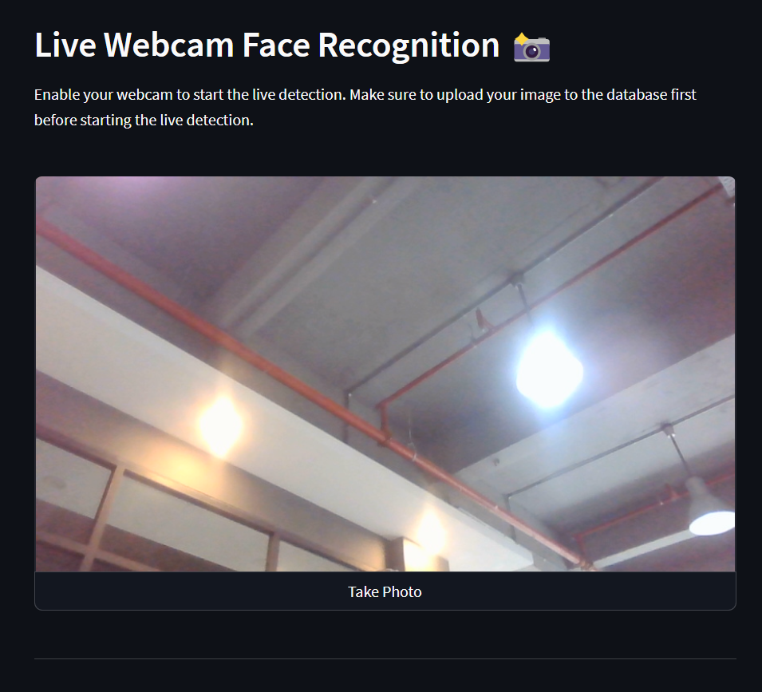

# __Face Recognition Web App 📸__
  This Face Recognition web app is made with Python, OpenCV as well as Streamlit. It is capable of detecting faces via live detection web cam 📸 or simply by uploading an image 📂. Head over to the website link to try it out 👇

## __Screenshots__

 

 