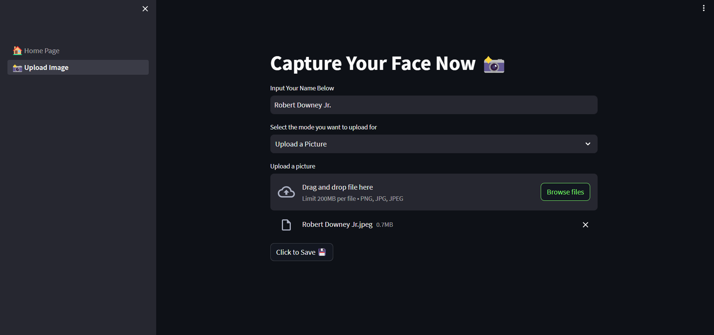

# __Face Recognition Web App 📸__
  This is a Face Recognition web app made with Python, OpenCV as well as Streamlit. It possesses the ability of detecting and recognising faces via live detection web cam 📸 or simply by uploading an image 📂. The app performs face recognition by leveraging the capabilities of the [Face_Recognition_API](https://github.com/ageitgey/face_recognition).

## __Website Link__
[https://face-recognition-web-app.streamlit.app/](https://face-recognition-web-app.streamlit.app/)

## __Requirements__
- Python 3.6+
- OpenCV
- Numpy
- Pandas
- Streamlit
- face_recognition

## __Screenshots__
### 1. Upload your image 📂 or Capture Image via Webcam 📸

 

### 2. Detect and Recognise Faces

 